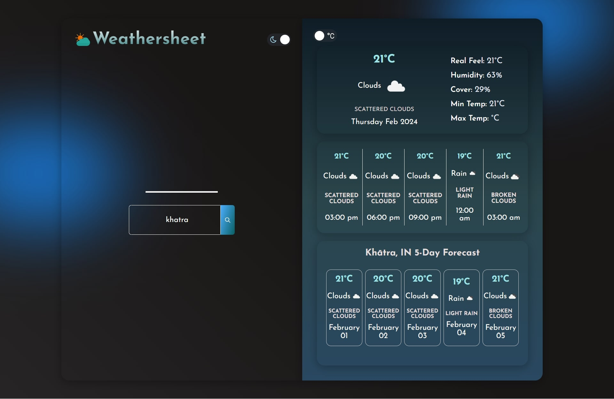

# 🌐 Weathersheet

Weathersheet is a sophisticated weather application designed to deliver comprehensive weather information with a clean and intuitive interface. Built using Vite for React, this project utilizes the OpenWeatherMap API to provide accurate and up-to-date weather data for locations worldwide.

## 🖼️ Preview



## ✨ Features

- **Location Search:** Search for weather details of any city or location globally.
- **Geolocation:** Obtain real-time weather information for your current location.
- **Detailed Weather Information:** Display current conditions, temperature, humidity, and cloud cover.
- **Forecast:** Access future weather forecasts for better planning.
- **Theme Options:** Choose between a light or dark theme for personalized visual comfort.
- **Temperature Units:** Toggle between Celsius and Fahrenheit for temperature readings.
- **Responsive Design:** Enjoy a seamless and optimized experience across various devices.
- **Error Handling:** User-friendly messages for invalid location searches or API request failures.

## 🛠️ Technologies Used

Weathersheet is built on the following cutting-edge technologies:

- **Vite:** A fast build tool that enhances the React development experience.
- **React.js:** A powerful JavaScript library for building user interfaces, utilized for state management and components.
- **OpenWeatherMap API:** A reliable source for weather data, offering a wide range of information, from current conditions to extended forecasts.
- **Axios:** A promise-based HTTP client used for making efficient API requests.

## 🚀 Getting Started

To run Weathersheet locally, follow these steps:

1. **Clone the repository:**
   ```bash
   git clone https://github.com/X-Saikat-93/weathersheet.git
   ```

2. **Navigate to the project directory:**
   ```bash
   cd weathersheet
   ```

3. **Install the dependencies:**
   ```bash
   npm install
   ```

4. **Obtain an API key by creating a free account on OpenWeatherMap.**

5. **Create a `.env` file in root and replace `VITE_REACT_APP_API_KEY` with your actual API key:**
   The `.env` file should look like this:
   ```plaintext
   VITE_REACT_APP_API_KEY=your_actual_api_key_here
   ```

6. **Start the development server:**
   ```bash
   npm run dev
   ```

7. **Open your web browser and visit `http://localhost:5173` to access Weathersheet.**

## 📚 Resources

- [OpenWeatherMap Documentation](https://openweathermap.org/)

## 🌟 Credits

Weathersheet is developed and maintained by [Your Full Name]. Weather data is sourced from the [OpenWeatherMap API](https://openweathermap.org/).

## 📧 Contacts

For inquiries or feedback, please contact [Your Email Address](mailto:ibx.saikat37@gmail.com).
